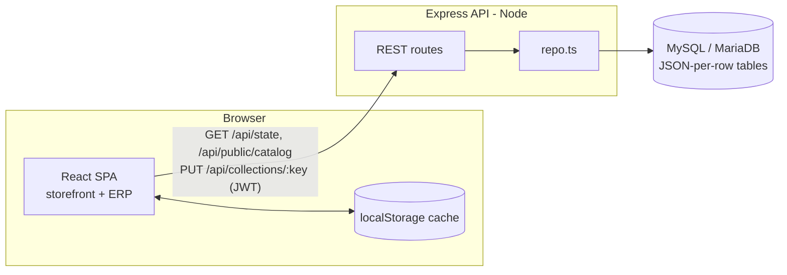

# ARCHITECTURE.md — Amanat Business Platform

> For any AI agent (Claude, GPT, Kimi, Gemini) or developer. Explains how the whole
> system fits together so you can make changes safely. Pair with **API.md** (every
> route/endpoint) and **DESIGN.md** (UI/UX).

---

## 1. One-paragraph overview

A **React 19 + TypeScript + Vite + Tailwind v4** single-page app (public storefront `/`
+ back-office ERP `/admin`) talking to a small **Express + TypeScript** API backed by
**MySQL/MariaDB** (hosted on Hostinger). All app state lives in one React context
(`AppContext`) that **hydrates from the DB on startup and debounce-syncs every change
back**, with `localStorage` as an offline cache. Auth is **JWT (bcrypt)** with
role-based access control. In production a single Node process serves both the built
frontend and the API on one origin.



---

## 2. Repository layout

```
/                         project root (one package.json for FE + BE)
├── index.html            Vite entry
├── vite.config.ts        Vite (port 3000)
├── tsconfig.json         FRONTEND tsconfig (excludes /server)
├── package.json          scripts for FE build + BE run/build + DB tasks
├── .env                  DB creds, JWT secret, VITE_API_BASE (git-ignored)
│
├── src/                  FRONTEND
│   ├── main.tsx          React root
│   ├── App.tsx           Router switch: '/', '/login', '/admin' + AdminApp shell
│   ├── router.tsx        Tiny custom router (history API, no react-router)
│   ├── types.ts          ALL domain types (Product, SaleInvoice, StaffUser, …)
│   ├── context/AppContext.tsx   THE global store (state + all mutations + sync)
│   ├── api/sync.ts       Backend client: auth, fetchState, public catalog, pushes
│   ├── auth/permissions.ts      RBAC tab→permission map (canAccessTab)
│   ├── data/initialData.ts      Seed defaults (imports electronicsProducts.json)
│   ├── data/electronicsProducts.json   353 imported products (generated)
│   └── components/       Feature views (see below)
│
├── server/               BACKEND
│   ├── schema.sql        All MySQL tables (canonical; also phpMyAdmin-importable)
│   ├── build.mjs         esbuild bundler → server/dist/*.js (for Hostinger)
│   ├── tsconfig.json     SERVER tsconfig (Bundler resolution)
│   └── src/
│       ├── server.ts     Express app + all routes + static frontend serving
│       ├── db.ts         mysql2 pool from env
│       ├── collections.ts  Registry: state-key → table + index columns (SSOT)
│       ├── repo.ts       Generic read/replace/upsert + getAllState
│       ├── auth.ts       bcrypt + JWT + requireAuth middleware + auth_users helpers
│       ├── migrate.ts    Create DB + run schema.sql        (npm run db:migrate)
│       ├── seed.ts       Import initialData into DB         (npm run db:seed)
│       ├── create-admin.ts   Create/reset super-admin login (npm run db:create-admin)
│       └── import-electronics.ts  Replace products w/ catalogue (npm run db:import-electronics)
│
├── scripts/generate-electronics.mjs   PDF-JSON → electronicsProducts.json mapper
├── DESIGN.md · ARCHITECTURE.md · API.md · DEPLOY_HOSTINGER.md
```

Frontend feature folders under `src/components/`: `layout` (Header, Sidebar), `pos`,
`inventory`, `sales`, `quotes`, `installments`, `suppliers`, `expenses`, `accounts`,
`crm`, `reports`, `admin` (RBAC, Settings), `auth` (LoginPage), `receipt`, `website`
(PublicStorefront), `common`.

---

## 3. State management & data flow

**Single store.** `AppContext.tsx` (`useApp()`) holds every collection as React state
plus ~40 mutation functions (addSale, updateProduct, processInstallmentPayment, …).
Business logic lives here, not in the backend. UI components are mostly presentational.

**Three-layer persistence:**
1. **In-memory** React state (source of truth while the app runs).
2. **`localStorage`** — every collection mirrors to a `amanot_*` key (offline cache / instant boot).
3. **MySQL** via the API — see sync below.

**Sync lifecycle** (`AppContext` + `api/sync.ts`), active only when `VITE_API_BASE` is set:
- On mount: if a JWT token exists → `fetchMe()` validates it → `fetchState()` loads the **full** state (all collections) and `applyFullState()` hydrates. If no token → `fetchPublicCatalog()` loads **products + settings + brands/categories only** (storefront works logged-out).
- After hydration, one `useEffect` per collection debounce-pushes changes:
  `pushCollection(key, data)` → `PUT /api/collections/:key` (700 ms debounce). Singletons →
  `pushSingleton`, master lists → `pushMasterList`. **Writes require a token**; guarded by
  `hydratedRef && authRef`.
- Public storefront quote submissions (logged-out) go to `POST /api/public/quote`.
- If the backend is unreachable, everything silently falls back to `localStorage` — the app never hard-fails on network.

> Consequence: to add a new synced entity you must touch **both** `AppContext` (state +
> mutations + a push `useEffect`) **and** `server/src/collections.ts` (registry) **and**
> `server/schema.sql` (table). Keep the camelCase state key identical across all three.

---

## 4. Data model (persistence shape)

**Document-per-row pattern.** Each collection is one MySQL table with:
- `id VARCHAR PK`, a few **indexed scalar columns** (business, status, phone, totals…) pulled out for querying, and a **`data JSON`** column holding the complete typed object (lossless round-trip with `src/types.ts`). MariaDB returns JSON as text; `repo.ts#parseData` handles both.

**Collections** (state key ↔ table), defined in `server/src/collections.ts`:

| Key | Table | Key | Table |
|-----|-------|-----|-------|
| staffUsers | staff_users | expenses | expenses |
| products | products | smsLogs | sms_logs |
| customers | customers | stockAdjustments | stock_adjustments |
| suppliers | suppliers | damageLogs | damage_logs |
| sales | sales | supplierReturns | supplier_returns |
| installmentPlans | installment_plans | accounts | accounts |
| quotations | quotations | accountTransfers | account_transfers |
| supplierRequisitions | supplier_requisitions | supplierPayments | supplier_payments |
| purchaseOrders | purchase_orders | | |

**Singletons** (table `app_singletons`, `name` PK, JSON `data`): `settings`, `auditConfig`,
plus master lists `brands`, `categories`, `expenseCategories`, `crmGroups`, `crmLeadSources`.

**Auth**: table `auth_users` (`email` unique, bcrypt `password_hash`, `staff_user_id` →
staff_users). Kept separate so password hashes never appear in `/api/state`.

> Note: `customer_returns` exists as a table in `schema.sql` but is **not** in the
> collections registry (not currently API-synced). Add it to `collections.ts` if you wire it up.

---

## 5. Authentication & RBAC

- **Login**: `POST /api/auth/login` verifies bcrypt password → returns `{ token (JWT), user (StaffUser) }`. Token stored in `localStorage['amanat_token']`, sent as `Authorization: Bearer <token>`.
- **Protected**: `GET /api/state`, all `PUT /api/...`, `GET /api/auth/me`, `POST /api/admin/users` require a valid token (`requireAuth`).
- **Public**: health, `public/catalog`, `public/quote`, `auth/login`.
- **RBAC**: `StaffUser.role` (`super_admin` | `staff`) + boolean `permissions` (canManagePOS, canManageInventory, canViewGlobalReports, canManageRBAC, …). `src/auth/permissions.ts#canAccessTab` maps each ERP tab to its required permission; super_admin passes everything. Sidebar hides disallowed tabs; `AdminApp` blocks direct render with `<NoAccess/>`.
- **User creation**: super-admin only, via `POST /api/admin/users` (creates staff_users row + auth_users login).
- Default owner login is created by `npm run db:create-admin` (`admin@amanatgroup.com`).

---

## 6. Routing (frontend)

Custom router in `src/router.tsx` (history API + `popstate`, `useRouter()` → `{ path, navigate }`). `App.tsx#Routes` switches:

| Path | Renders | Guard |
|------|---------|-------|
| `/` (and anything else) | `PublicStorefront` | public |
| `/login` | `LoginPage` | redirects to `/admin` if already authed |
| `/admin` | `AdminApp` (Header + Sidebar + active view) | redirects to `/login` if not authed |

Inside `/admin`, the active screen is chosen by `activeTab` (an `ERPTab`) held in
`AppContext`, not by the URL — `pos`, `inventory`, `invoices`, `quotes`, `installments`,
`suppliers`, `expenses`, `accounts`, `crm`, `global_reports`, `audit_reports`, `rbac`,
`settings`, `website`.

---

## 7. Environment & config

`.env` at project root (read by both Vite and the server):
```
DB_HOST, DB_PORT, DB_USER, DB_PASSWORD, DB_NAME   # MySQL (Hostinger or local)
PORT=8000                                          # API port
CORS_ORIGIN=http://localhost:3000                  # dev only
JWT_SECRET=…  JWT_TTL=30d                           # auth
VITE_API_BASE=http://localhost:8000                # browser → API base
#   dev: API dev-server URL   ·   prod (same origin): ""   ·   unset: offline/localStorage-only
```

---

## 8. Build, run, deploy

**Local dev** (two terminals): `npm run server:dev` (API :8000, tsx watch) + `npm run dev` (Vite :3000).

**DB tasks:** `npm run db:migrate` → `db:seed` (or `db:setup` for both) → `db:create-admin`
→ `db:import-electronics`.

**Production (Hostinger, single Node app):** `npm run build` (frontend → `dist/`) +
`npm run build:server` (backend → `server/dist/*.js` via esbuild). Start
`node server/dist/server.js`; when `dist/` exists the server also serves the SPA with an
`/*` fallback, so API + site share one origin. Full steps in **DEPLOY_HOSTINGER.md**.

---

## 9. Invariants & gotchas (read before editing)

- **Keep the collection key identical** across `AppContext`, `collections.ts`, and `schema.sql`.
- Business logic (stock deduction, EMI schedules, dues, supplier balances) is **in `AppContext`**, not the API. The API is a dumb persistence layer (replace-collection / upsert-singleton).
- `PUT /api/collections/:key` **replaces the whole collection** (delete-all + bulk insert in a transaction). The client always sends the full array.
- Numbers/money are BDT `৳`; keep `.toLocaleString()` + `font-mono` in UI (see DESIGN.md).
- Frontend tsconfig excludes `server/`; server has its own tsconfig (`Bundler` resolution, `.ts` imports without extension). Typecheck both: `npx tsc --noEmit` and `npx tsc --noEmit -p server/tsconfig.json`.
- `src/data/electronicsProducts.json` is **generated** — edit `scripts/generate-electronics.mjs` and re-run, don't hand-edit.
- The app degrades gracefully offline; never assume the API is reachable in UI code.
